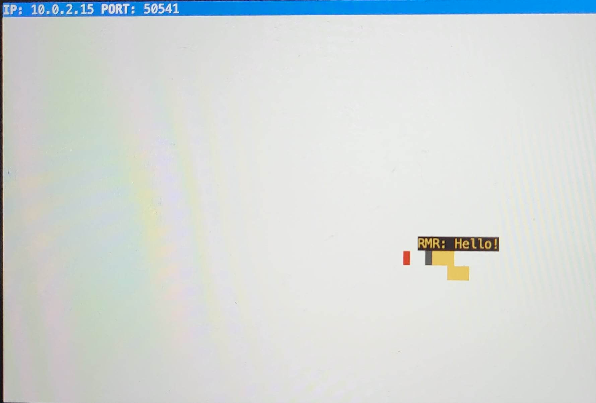

# Snake Client Project
The Snake Game is a classic video game where the player controls a snake-like creature that grows in length by eating pieces of food. The goal of the game is to navigate the snake around the game board, avoiding collisions with the walls or the snake's own body, while consuming as much food as possible to maximize the snake's length.

## Final Product

# How To Play

1. Run the development snake client using the node play.js command.

2. Alternatively, you can use the following keys to control the snake:
Press W to move the snake up.
Press A to move the snake left.
Press S to move the snake down.
Press D to move the snake right.
Press Z to say "Hello!".
Press X to say "Goodbye!".

3. Guide the snake to the food items on the game board to make it grow.

4. If you want to play again, run node play.js again from the client side.

5. To quit the game at any time, press CTRL + C in the client side or CONTROL + C on MAC.

## Getting Started

- server code for this game was not written from scratch. It is a heavily modified version of the single player game Snek created by Tania Rascia.

- Follow steps inside the snek server repo to run the server side

- Run the development snake client using the `node play.js` command.